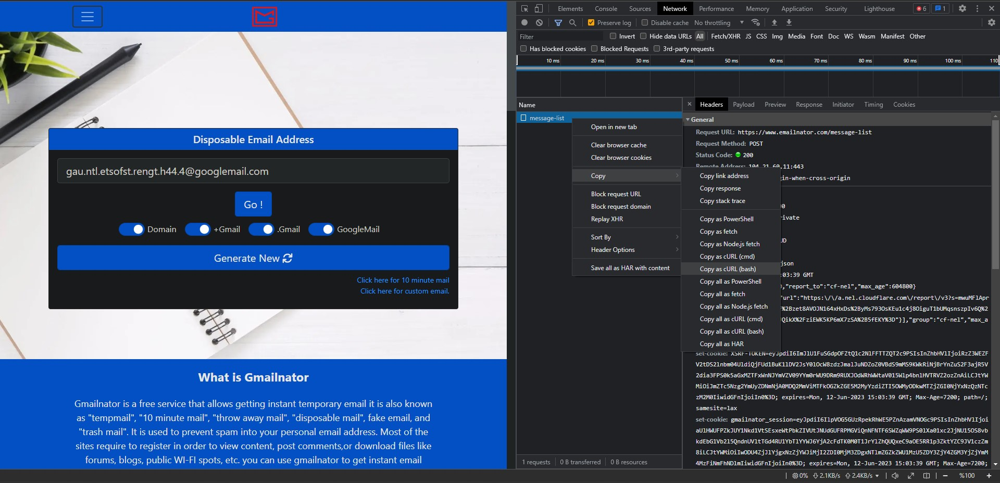

# Perplexity.ai
This module is simply just an API Wrapper and account generator. It serves as an API wrapper with free copilots.

## How It Works
This module uses [emailnator](https://emailnator.com/) to generate new accounts. As you know, when you create a new account, you will have 5 copilots. That's how it works! This module will generate you new gmails (using @googlemail.com right now) with [emailnator](https://emailnator.com/) and you will have **UNLIMITED COPILOTS!**

## Requirements

<details>
<summary>Click to expand</summary>
<br>

* [requests](https://pypi.org/project/requests/)
* [requests-toolbelt](https://pypi.org/project/requests-toolbelt/)
* [beautifulsoup4](https://pypi.org/project/beautifulsoup4/)
* [lxml](https://pypi.org/project/lxml/) (Parser for BeautifulSoup)
* [websocket-client](https://pypi.org/project/websocket-client/)
* [aiohttp](https://pypi.org/project/aiohttp/) (if you are going to use asynchronous version)


Install requirements with:
```sh
pip3 install -r requirements.txt
```

or with single-line command:
```sh
pip3 install requests&&pip3 install beautifulsoup4&&pip3 install lxml&&pip3 install websocket-client&&pip3 install requests-toolbelt
```

and aiohttp if you are going to use asynchronous version:

```sh
pip3 install aiohttp
```

</details>


## How To Use
First thing first, [Perplexity.ai](https://perplexity.ai/) is protected by cloudflare, and [emailnator](https://emailnator.com/) too. We need to open this pages manually and get the cookies. Do not forget these cookies are temporary, so you need to renew them continuously. [Here](#how-to-get-the-cookies) how to get your cookies.

```python3
import perplexity

perplexity_headers = {
    <your headers here>
}

perplexity_cookies = { 
    <your cookies here>
}

emailnator_headers = { 
    <your headers here>
}

emailnator_cookies = { 
    <your cookies here>
}


perplexity_cli = perplexity.Client(perplexity_headers, perplexity_cookies)
perplexity_cli.create_account(emailnator_headers, emailnator_cookies) # Creates a new gmail, so your 5 copilots will be renewed. You can pass this one if you are not going to use "copilot" mode


# takes a string as query, and returns a string as answer.
def my_text_prompt_solver(query):
    return input(f'{query}: ')

# takes a string as description and a dictionary as options. Dictionary consists of ids and values. Example: {1: "Orange", 2: "Banana"}
# returns a list of integers which are ids of selected options. Let's say you selected "Banana", function should return [2]
def my_checkbox_prompt_solver(description, options):
    print(description + '\n' + '\n'.join([str(x) + ' - ' + options[x] for x in options]))
    return [int(input('--> '))]


# modes = ['concise', 'copilot']
# focus = ['internet', 'scholar', 'writing', 'wolfram', 'youtube', 'reddit']
# files = file list, each element of list is tuple like this: (data, filetype) perplexity supports two file types, txt and pdf
# follow_up = last query info for follow-up queries, you can directly pass response json from a query, look at second example below.
# solvers, list of functions to answer questions of ai while using copilot, there are 2 type of solvers, text and checkbox. If you do not define function for a solver, questions in that solver type will be skipped
resp = perplexity_cli.search('Your query here', mode='copilot', focus='internet', files=[(open('myfile.txt', 'rb').read(), 'txt'), (open('myfile2.pdf', 'rb').read(), 'pdf')], solvers={
    'text': my_text_prompt_solver,
    'checkbox': my_checkbox_prompt_solver
    })
print(resp)

# second example to show how to use follow-up queries
# you can't use file uploads on follow-up queries
# you can pass response json from a query directly like below
resp2 = perplexity_cli.search('Your query here', mode='copilot', focus='internet', follow_up=resp, solvers={
    'text': my_text_prompt_solver,
    'checkbox': my_checkbox_prompt_solver
    })
print(resp2)

# perplexity_cli.create_account(emailnator_headers, emailnator_cookies) # Call this function again when you run out of copilots
```


<details>
<summary><h2>Labs</h2></summary>
<br>

```python3
import perplexity

labs_cli = perplexity.LabsClient()

# model = ['pplx-7b-chat-alpha', 'pplx-70b-chat-alpha', 'mistral-7b-instruct', 'codellama-34b-instruct', 'llama-2-13b-chat', 'llama-2-70b-chat']
print(labs_cli.ask('hi', model='pplx-7b-chat-alpha'))
```

</details>


<details>
<summary><h2>Pool</h2></summary>
<br>
If you don't want to wait while creating account, then pool is what you're looking for. It will simply work on background and create accounts when your current copilot & file upload count is lower than the limit.

<br>

```python3
import perplexity

perplexity_headers = {
    <your headers here>
}

perplexity_cookies = { 
    <your cookies here>
}

emailnator_headers = { 
    <your headers here>
}

emailnator_cookies = { 
    <your cookies here>
}


def my_text_prompt_solver(query):
    return input(f'{query}: ')

def my_checkbox_prompt_solver(description, options):
    print(description + '\n' + '\n'.join([str(x) + ' - ' + options[x] for x in options]))
    return [int(input('--> '))]

# copilots = minimum needed copilot count, when current copilot count is lower than this, a new account will be created in the background
# file_uploads = minimum needed file upload count, when current file upload count is lower than this, a new account will be created in the background
# threads = how many accounts will be created in the background at the same time, if you're not going to use 50+ copilots in a minute, don't increase this
pool = perplexity.Pool(perplexity_headers, perplexity_cookies, emailnator_headers, emailnator_cookies, copilots=10, file_uploads=5, threads=1)

# everything is same
resp = pool.search('Your query here', mode='copilot', focus='internet', files=[(open('myfile.txt', 'rb').read(), 'txt'), (open('myfile2.pdf', 'rb').read(), 'pdf')], solvers={
    'text': my_text_prompt_solver,
    'checkbox': my_checkbox_prompt_solver
    })
print(resp)
```

</details>


<br>

## Asynchronous Version

```python3
import perplexity_async
import asyncio

perplexity_headers = { 
    <your headers here>
}

perplexity_cookies = { 
    <your cookies here> 
}

emailnator_headers = { 
    <your headers here>
}

emailnator_cookies = { 
    <your cookies here>
}


# takes a string as query, and returns a string as answer.
async def my_text_prompt_solver(query):
    return input(f'{query}: ')

# takes a string as description and a dictionary as options. Dictionary consists of ids and values. Example: {1: "Orange", 2: "Banana"}
# returns a list of integers which are ids of selected options. Let's say you selected "Banana", function should return [2]
async def my_checkbox_prompt_solver(description, options):
    print(description + '\n' + '\n'.join([str(x) + ' - ' + options[x] for x in options]))
    return [int(input('--> '))]


async def test():
    perplexity_cli = await perplexity_async.Client(perplexity_headers, perplexity_cookies)
    await perplexity_cli.create_account(emailnator_headers, emailnator_cookies) # Creates a new gmail, so your 5 copilots will be renewed. You can pass this one if you are not going to use "copilot" mode

    # modes = ['concise', 'copilot']
    # focus = ['internet', 'scholar', 'writing', 'wolfram', 'youtube', 'reddit']
    # files = file list, each element of list is tuple like this: (data, filetype) perplexity supports two file types, txt and pdf
    # follow_up = last query info for follow-up queries, you can directly pass response json from a query, look at second example below.
    # solvers, list of functions to answer questions of ai while using copilot, there are 2 type of solvers, text and checkbox. If you do not define function for a solver, questions in that solver type will be skipped
    resp = await perplexity_cli.search('Your query here', mode='copilot', focus='internet', files=[(open('myfile.txt', 'rb').read(), 'txt'), (open('myfile2.pdf', 'rb').read(), 'pdf')], solvers={
        'text': my_text_prompt_solver,
        'checkbox': my_checkbox_prompt_solver
    })
    print(resp)

    # second example to show how to use follow-up queries
    # you can't use file uploads on follow-up queries
    # you can pass response json from a query directly like below
    resp2 = await perplexity_cli.search('Your query here', mode='copilot', focus='internet', follow_up=resp, solvers={
        'text': my_text_prompt_solver,
        'checkbox': my_checkbox_prompt_solver
    })
    print(resp2)

    # await perplexity_cli.create_account(emailnator_headers, emailnator_cookies) # Call this function again when you're out of copilots

asyncio.run(test())
```


<details>
<summary><h2>Asynchronous Labs</h2></summary>
<br>

```python3
import perplexity_async

async def test():
    labs_cli = await perplexity_async.LabsClient()

    # model = ['pplx-7b-chat-alpha', 'pplx-70b-chat-alpha', 'mistral-7b-instruct', 'codellama-34b-instruct', 'llama-2-13b-chat', 'llama-2-70b-chat']
    print(await labs_cli.ask('hi', model='pplx-7b-chat-alpha'))

asyncio.run(test())
```

</details>

<br>


## How To Get The Cookies
Do not forget these cookies are temporary, so you need to renew them continuously.

1. Open [emailnator](https://emailnator.com/) website. Click F12 or Ctrl+Shift+I to open inspector. Go to the "Network" tab in the inspector, check "Preserve log" button, click the "Go !" button in the website, right click the "message-list" in the Network Tab and hover on "Copy" and click to "Copy as cURL (bash)". Now go to the [curlconverter](https://curlconverter.com/python/), paste your code here. The header and cookies dictionary will appear, copy and use them in your codes.




2. Open [Perplexity.ai](https://perplexity.ai/) website. Sign out if you're signed in. Click F12 or Ctrl+Shift+I to open inspector. Go to the "Network" tab in the inspector, check "Preserve log" button, click the "Sign Up" button in the website, enter a random email and click "Continue with Email" button, right click the "email" in the Network Tab and hover on "Copy" and click to "Copy as cURL (bash)". Now go to the [curlconverter](https://curlconverter.com/python/), paste your code here. The header and cookies dictionary will appear, copy them and use in your codes.


3. Don't confuse the headers and cookies for [emailnator](https://emailnator.com/) and [Perplexity.ai](https://perplexity.ai/), look at [How To Use](#how-to-use) to learn how to use them.


# Thanks To
* [perplexityai](https://github.com/nathanrchn/perplexityai) by [nathanrchn](https://github.com/nathanrchn)
* [dominicOT](https://github.com/dominicOT) and [Kerry1207](https://github.com/Kerry1207) for their contributions
