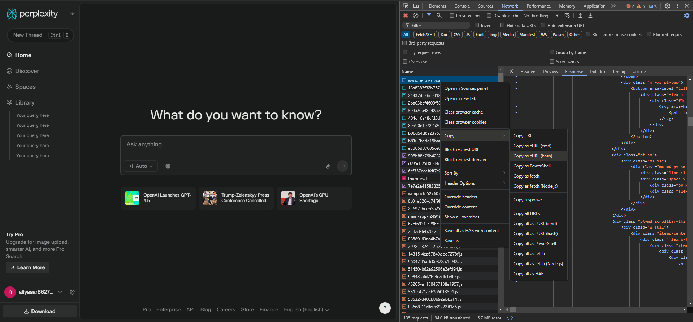
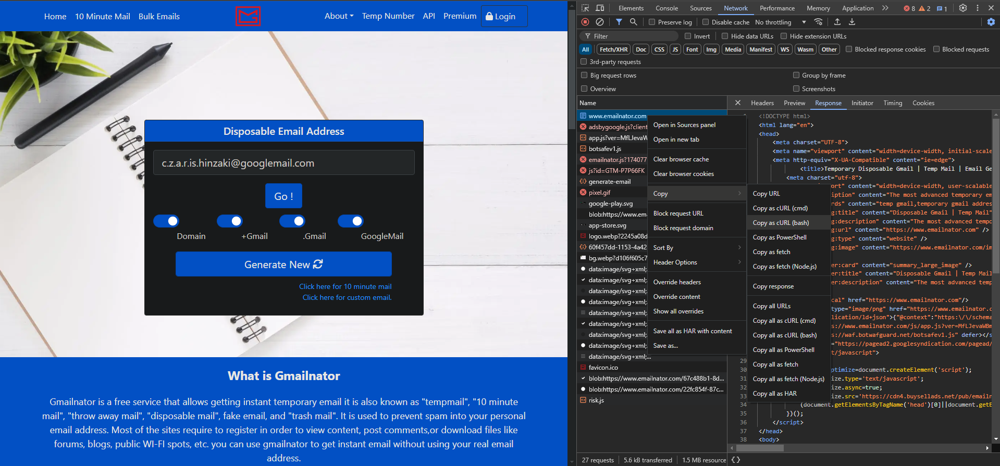

# Perplexity AI

Perplexity AI is a Python module that leverages [Emailnator](https://emailnator.com/) to generate new accounts for unlimited pro queries. It supports both synchronous and asynchronous APIs, as well as a web interface for users who prefer a GUI-based approach.

## Features

- **Account Generation**: Automatically generate Gmail accounts using Emailnator.
- **Unlimited Pro Queries**: Bypass query limits by creating new accounts.
- **Web Interface**: Automate account creation and usage via a browser.
- **API Support**: Synchronous and asynchronous APIs for programmatic access.

## Installation

Install the required packages:

```bash
pip install perplexity-api perplexity-api-async
```

For the web interface, install additional dependencies:

```bash
pip install patchright playwright && patchright install chromium
```

## Usage

### Web Interface

The web interface automates account creation and usage in a browser. [Patchright](https://github.com/Kaliiiiiiiiii-Vinyzu/patchright-python#best-practices) uses ["Chrome User Data Directory"](https://www.google.com/search?q=chrome+user+data+directory) to be completely undetected, it's ``C:\Users\YourName\AppData\Local\Google\Chrome\User Data`` for Windows, as shown below:

```python
import os
from perplexity.driver import Driver

cli = Driver()
cli.run(rf'C:\\Users\\{os.getlogin()}\\AppData\\Local\\Google\\Chrome\\User Data')
```

To use your own Chrome instance, enable remote debugging (it may enter dead loop in Cloudflare):

1. Add `--remote-debugging-port=9222` to Chrome's shortcut target.
2. Pass the port to the `Driver.run()` method:

```python
cli.run(rf'C:\\Users\\{os.getlogin()}\\AppData\\Local\\Google\\Chrome\\User Data', port=9222)
```

### API Usage

#### Synchronous API

Below is an example code for simple usage, without using your own account or generating new accounts.

```python3
import perplexity

perplexity_cli = perplexity.Client()

# mode = ['auto', 'pro', 'reasoning', 'deep research']
# model = model for mode, which can only be used in own accounts, that is {
#     'auto': [None],
#     'pro': [None, 'sonar', 'gpt-4.5', 'gpt-4o', 'claude 3.7 sonnet', 'gemini 2.0 flash', 'grok-2'],
#     'reasoning': [None, 'r1', 'o3-mini', 'claude 3.7 sonnet'],
#     'deep research': [None]
# }
# sources = ['web', 'scholar', 'social']
# files = a dictionary which has keys as filenames and values as file data
# stream = returns a generator when enabled and just final response when disabled
# language = ISO 639 code of language you want to use
# follow_up = last query info for follow-up queries, you can directly pass response from a query, look at second example below
# incognito = Enables incognito mode, for people who are using their own account
resp = perplexity_cli.search('Your query here', mode='auto', model=None, sources=['web'], files={}, stream=False, language='en-US', follow_up=None, incognito=False)
print(resp)

# second example to show how to use follow-up queries and stream response
for i in perplexity_cli.search('Your query here', stream=True, follow_up=resp):
    print(i)
```

And this is how you use your own account, you need to get your cookies in order to use your own account. Look at [How To Get Cookies](#how-to-get-cookies),

```python3
import perplexity

perplexity_cookies = { 
    <your cookies here>
}

perplexity_cli = perplexity.Client(perplexity_cookies)

resp = perplexity_cli.search('Your query here', mode='reasoning', model='o3-mini', sources=['web'], files={'myfile.txt': open('file.txt').read()}, stream=False, language='en-US', follow_up=None, incognito=False)
print(resp)
```

And finally account generating, you need to get cookies for [Emailnator](https://emailnator.com/) to use this feature. Look at [How To Get Cookies](#how-to-get-cookies),

```python3
import perplexity

emailnator_cookies = { 
    <your cookies here>
}

perplexity_cli = perplexity.Client()
perplexity_cli.create_account(emailnator_cookies) # Creates a new gmail, so your 5 pro queries will be renewed.

resp = perplexity_cli.search('Your query here', mode='reasoning', model=None, sources=['web'], files={'myfile.txt': open('file.txt').read()}, stream=False, language='en-US', follow_up=None, incognito=False)
print(resp)
```

#### Asynchronous API

Below is an example code for simple usage, without using your own account or generating new accounts.

```python3
import asyncio
import perplexity_async

async def test():
    perplexity_cli = await perplexity_async.Client()

    # mode = ['auto', 'pro', 'reasoning', 'deep research']
    # model = model for mode, which can only be used in own accounts, that is {
    #     'auto': [None],
    #     'pro': [None, 'sonar', 'gpt-4.5', 'gpt-4o', 'claude 3.7 sonnet', 'gemini 2.0 flash', 'grok-2'],
    #     'reasoning': [None, 'r1', 'o3-mini', 'claude 3.7 sonnet'],
    #     'deep research': [None]
    # }
    # sources = ['web', 'scholar', 'social']
    # files = a dictionary which has keys as filenames and values as file data
    # stream = returns a generator when enabled and just final response when disabled
    # language = ISO 639 code of language you want to use
    # follow_up = last query info for follow-up queries, you can directly pass response from a query, look at second example below
    # incognito = Enables incognito mode, for people who are using their own account
    resp = await perplexity_cli.search('Your query here', mode='auto', model=None, sources=['web'], files={}, stream=False, language='en-US', follow_up=None, incognito=False)
    print(resp)

    # second example to show how to use follow-up queries and stream response
    async for i in await perplexity_cli.search('Your query here', stream=True, follow_up=resp):
        print(i)

asyncio.run(test())
```

And this is how you use your own account, you need to get your cookies in order to use your own account. Look at [How To Get The Cookies](#how-to-get-the-cookies),

```python3
import asyncio
import perplexity_async

perplexity_cookies = { 
    <your cookies here>
}

async def test():
    perplexity_cli = await perplexity_async.Client(perplexity_cookies)

    resp = await perplexity_cli.search('Your query here', mode='reasoning', model='o3-mini', sources=['web'], files={'myfile.txt': open('file.txt').read()}, stream=False, language='en-US', follow_up=None, incognito=False)
    print(resp)

asyncio.run(test())
```

And finally account generating, you need to get cookies for [emailnator](https://emailnator.com/) to use this feature. Look at [How To Get The Cookies](#how-to-get-the-cookies),

```python3
import asyncio
import perplexity_async

emailnator_cookies = { 
    <your cookies here>
}

async def test():
    perplexity_cli = await perplexity_async.Client()
    await perplexity_cli.create_account(emailnator_cookies) # Creates a new gmail, so your 5 pro queries will be renewed.

    resp = await perplexity_cli.search('Your query here', mode='reasoning', model=None, sources=['web'], files={'myfile.txt': open('file.txt').read()}, stream=False, language='en-US', follow_up=None, incognito=False)
    print(resp)

asyncio.run(test())
```

## How to Get Cookies

### Perplexity (to use your own account)
* Open [Perplexity.ai](https://perplexity.ai/) website and login to your account.
* Click F12 or ``Ctrl + Shift + I`` to open inspector.
* Go to the "Network" tab in the inspector.
* Refresh the page, right click the first request, hover on "Copy" and click to "Copy as cURL (bash)".
* Now go to the [CurlConverter](https://curlconverter.com/python/) and paste your code here. The cookies dictionary will appear, copy and use it in your codes.



### Emailnator (for account generating)
* Open [Emailnator](https://emailnator.com/) website and verify you're human.
* Click F12 or ``Ctrl + Shift + I`` to open inspector.
* Go to the "Network" tab in the inspector.
* Refresh the page, right click the first request, hover on "Copy" and click to "Copy as cURL (bash)".
* Now go to the [CurlConverter](https://curlconverter.com/python/) and paste your code here. The cookies dictionary will appear, copy and use it in your codes.
* Cookies for [Emailnator](https://emailnator.com/) are temporary, you need to renew them continuously.



## License

This project is licensed under the MIT License. See the [LICENSE](LICENSE) file for details.
