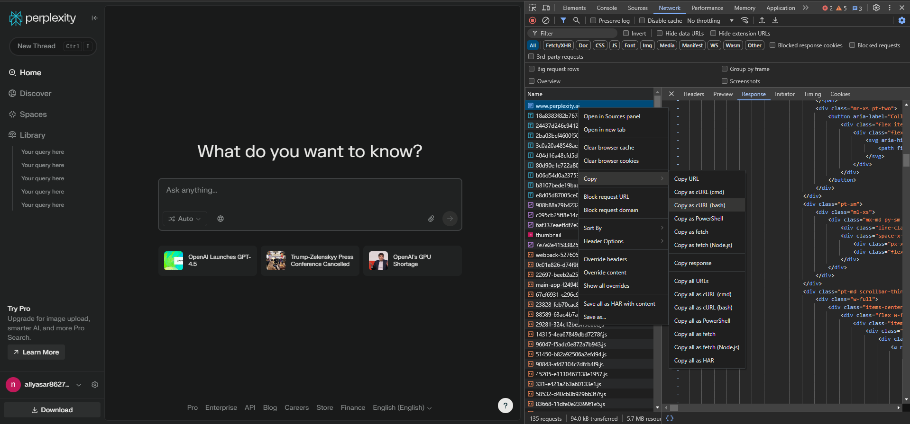
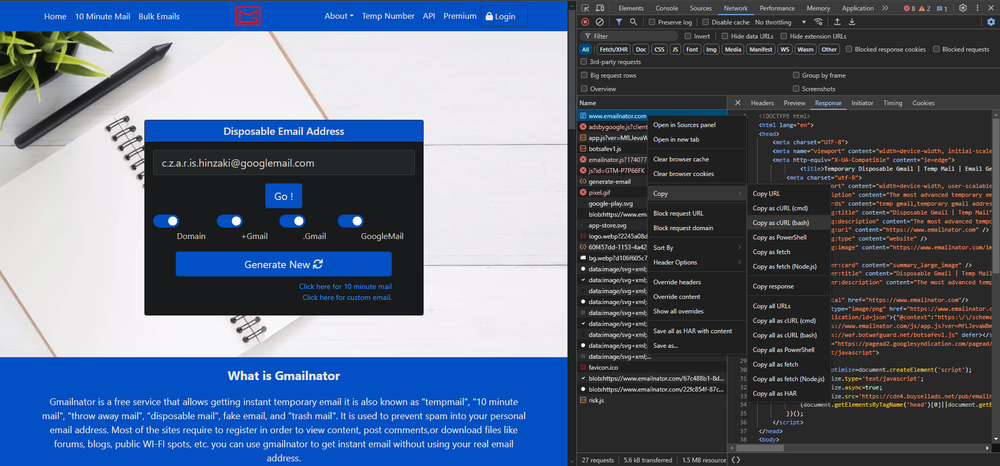

# Perplexity AI


Perplexity AI is a Python module that leverages [Emailnator](https://emailnator.com/) to generate new accounts for unlimited pro queries. It supports both synchronous and asynchronous APIs, as well as a web interface for users who prefer a GUI-based approach.

## Features

- **Account Generation**: Automatically generate Gmail accounts using Emailnator
- **Unlimited Pro Queries**: Bypass query limits by creating new accounts
- **Web Interface**: Automate account creation and usage via a browser
- **Sync & Async APIs**: Full support for both synchronous and asynchronous programming
- **Type Safety**: Complete type hints for better IDE support
- **Robust Error Handling**: Custom exceptions for better error management
- **Comprehensive Logging**: Structured logging for debugging
- **File Upload**: Support for document analysis and Q&A
- **Streaming Responses**: Real-time response streaming
- **Retry Logic**: Automatic retry with exponential backoff
- **Rate Limiting**: Built-in rate limiting to prevent abuse

## Installation

### Basic Installation

```bash
pip install -e .
```

### With Driver Support (Web Interface)

```bash
pip install -e ".[driver]"
patchright install chromium
```

### With MCP Server

```bash
pip install -e ".[mcp]"
```

### Development Installation

```bash
pip install -e ".[dev]"
```

This includes testing tools (pytest, pytest-cov, pytest-asyncio), linting (flake8, black, isort, mypy), and all optional dependencies.

## MCP Server

This project includes an MCP (Model Context Protocol) server that exposes Perplexity search as tools for Claude Code and other MCP clients. It works without an API key by using the same reverse-engineered web interface as the rest of this library.

### Installation

```bash
pip install -e ".[mcp]"
```

### Running the Server

The server supports two transports, controlled by the `MCP_TRANSPORT` environment variable (default: `stdio`).

#### stdio (default)

Used by local MCP clients like Claude Code and Claude Desktop. The client spawns the process directly.

```bash
perplexity-mcp
```

Add to Claude Code:

```bash
claude mcp add perplexity -- perplexity-mcp
```

Manual config:

```json
{
  "mcpServers": {
    "perplexity": {
      "command": "perplexity-mcp",
      "env": {
        "PERPLEXITY_COOKIES": "{\"next-auth.session-token\": \"...\"}"
      }
    }
  }
}
```

#### HTTP (network/remote)

Runs a persistent HTTP server that multiple clients can connect to over the network. Use this when you want to share one server instance across multiple clients or machines.

**1. Start the server:**

```bash
MCP_TRANSPORT=http perplexity-mcp
```

Defaults to `127.0.0.1:8000`. To bind to all interfaces or change the port:

```bash
MCP_TRANSPORT=http MCP_HOST=0.0.0.0 MCP_PORT=9000 perplexity-mcp
```

To include cookies:

```bash
MCP_TRANSPORT=http PERPLEXITY_COOKIES='{"next-auth.session-token": "..."}' perplexity-mcp
```

The MCP endpoint will be available at `http://<host>:<port>/mcp`.

**2. Add to Claude Code:**

```bash
claude mcp add --transport http perplexity http://127.0.0.1:8000/mcp
```

Adjust the URL if you changed the host or port. For a remote machine, replace `127.0.0.1` with its address.

**3. Verify:**

```bash
claude mcp list
```

---

The `PERPLEXITY_COOKIES` environment variable is optional for both transports. If not set, the server runs anonymously with access to free (auto mode) queries only. Set it to a JSON string of your Perplexity cookies to enable pro, reasoning, and deep research modes. See [How To Get Cookies](#how-to-get-cookies) for instructions.

### Available Tools

| Tool | Mode | Description |
|------|------|-------------|
| `perplexity_ask` | `auto` | General-purpose question answering |
| `perplexity_research` | `deep research` | In-depth research on a topic |
| `perplexity_reason` | `reasoning` | Step-by-step reasoning through a problem |
| `perplexity_search` | `pro` + web sources | Web search |

### Differences from the Official MCP

The [official `@perplexity-ai/mcp-server`](https://www.npmjs.com/package/@perplexity-ai/mcp-server) requires a paid Perplexity API key. This server uses the reverse-engineered web interface instead. As a result, the following features available in the official MCP are not supported here:

| Feature | Official MCP | This server |
|---------|-------------|-------------|
| No API key required | No | **Yes** |
| `messages` array input | Yes | No (single `query` string only) |
| `search_recency_filter` | Yes | No |
| `search_domain_filter` | Yes | No |
| `search_context_size` | Yes | No |
| `reasoning_effort` | Yes | No |
| `strip_thinking` | Yes | No |
| Structured search results (citations, images) | Yes | No (plain text answer only) |

## Quick Start

### Basic Usage

```python
import perplexity

# Create client
client = perplexity.Client()

# Make a query
response = client.search("What is artificial intelligence?")
print(response['answer'])
```

### With Account (for enhanced features)

```python
import perplexity

# Your Perplexity cookies
cookies = {
    'next-auth.csrf-token': 'your-token',
    'next-auth.session-token': 'your-session',
}

client = perplexity.Client(cookies)

# Use enhanced modes
response = client.search(
    "Complex query here",
    mode='pro',
    model='gpt-5.2',
    sources=['scholar']
)
```

### Streaming Responses

```python
for chunk in client.search("Explain quantum computing", stream=True):
    if 'answer' in chunk:
        print(chunk['answer'], end='', flush=True)
```

### Async Usage

```python
import asyncio
import perplexity_async

async def main():
    client = await perplexity_async.Client()
    response = await client.search("What is machine learning?")
    print(response['answer'])

asyncio.run(main())
```

## Documentation

- **[Examples](examples/)** - Practical examples for common use cases
- **[Changelog](docs/CHANGELOG.md)** - Bug fixes and changes history
- **[Improvements](docs/IMPROVEMENTS.md)** - Suggested improvements and roadmap
- **[API Reference](#api-reference)** - Complete API documentation

## Usage

### Web Interface

The web interface automates account creation and usage in a browser. [Patchright](https://github.com/Kaliiiiiiiiii-Vinyzu/patchright-python#best-practices) uses ["Chrome User Data Directory"](https://www.google.com/search?q=chrome+user+data+directory) to be completely undetected, it's ``C:\Users\YourName\AppData\Local\Google\Chrome\User Data`` for Windows, as shown below:

```python
import os
from perplexity.driver import Driver

cli = Driver()
cli.run(rf'C:\\Users\\{os.getlogin()}\\AppData\\Local\\Google\\Chrome\\User Data')
```

To use your own Chrome instance, enable remote debugging (it may enter dead loop in Cloudflare):

1. Add `--remote-debugging-port=9222` to Chrome's shortcut target.
2. Pass the port to the `Driver.run()` method:

```python
cli.run(rf'C:\\Users\\{os.getlogin()}\\AppData\\Local\\Google\\Chrome\\User Data', port=9222)
```

### API Usage

#### Synchronous API

Below is an example code for simple usage, without using your own account or generating new accounts.

```python3
import perplexity

perplexity_cli = perplexity.Client()

# model = model for mode, which can only be used in own accounts, that is {
#     'auto': [None],
#     'pro': [None, 'sonar', 'gpt-5.2', 'claude-4.5-sonnet', 'grok-4-1'],
#     'reasoning': [None, 'gpt-5.2-thinking', 'claude-4.5-sonnet-thinking', 'gemini-3.0-pro', 'kimi-k2-thinking', 'grok-4.1-reasoning'],
#     'deep research': [None]
# }
# sources = ['web', 'scholar', 'social']
# files = a dictionary which has keys as filenames and values as file data
# stream = returns a generator when enabled and just final response when disabled
# language = ISO 639 code of language you want to use
# follow_up = last query info for follow-up queries, you can directly pass response from a query, look at second example below
# incognito = Enables incognito mode, for people who are using their own account
resp = perplexity_cli.search('Your query here', mode='auto', model=None, sources=['web'], files={}, stream=False, language='en-US', follow_up=None, incognito=False)
print(resp)

# second example to show how to use follow-up queries and stream response
for i in perplexity_cli.search('Your query here', stream=True, follow_up=resp):
    print(i)
```

And this is how you use your own account, you need to get your cookies in order to use your own account. Look at [How To Get Cookies](#how-to-get-cookies),

```python3
import perplexity

perplexity_cookies = { 
    <your cookies here>
}

perplexity_cli = perplexity.Client(perplexity_cookies)

resp = perplexity_cli.search('Your query here', mode='reasoning', model='gpt-5.2-thinking', sources=['web'], files={'myfile.txt': open('file.txt').read()}, stream=False, language='en-US', follow_up=None, incognito=False)
print(resp)
```

And finally account generating, you need to get cookies for [Emailnator](https://emailnator.com/) to use this feature. Look at [How To Get Cookies](#how-to-get-cookies),

```python3
import perplexity

emailnator_cookies = { 
    <your cookies here>
}

perplexity_cli = perplexity.Client()
perplexity_cli.create_account(emailnator_cookies) # Creates a new gmail, so your 5 pro queries will be renewed.

resp = perplexity_cli.search('Your query here', mode='reasoning', model=None, sources=['web'], files={'myfile.txt': open('file.txt').read()}, stream=False, language='en-US', follow_up=None, incognito=False)
print(resp)
```

#### Asynchronous API

Below is an example code for simple usage, without using your own account or generating new accounts.

```python3
import asyncio
import perplexity_async

async def test():
    perplexity_cli = await perplexity_async.Client()

    # mode = ['auto', 'pro', 'reasoning', 'deep research']
    # model = model for mode, which can only be used in own accounts, that is {
    #     'auto': [None],
    #     'pro': [None, 'sonar', 'gpt-5.2', 'claude-4.5-sonnet', 'grok-4-1'],
    #     'reasoning': [None, 'gpt-5.2-thinking', 'claude-4.5-sonnet-thinking', 'gemini-3.0-pro', 'kimi-k2-thinking', 'grok-4.1-reasoning'],
    #     'deep research': [None]
    # }
    # sources = ['web', 'scholar', 'social']
    # files = a dictionary which has keys as filenames and values as file data
    # stream = returns a generator when enabled and just final response when disabled
    # language = ISO 639 code of language you want to use
    # follow_up = last query info for follow-up queries, you can directly pass response from a query, look at second example below
    # incognito = Enables incognito mode, for people who are using their own account
    resp = await perplexity_cli.search('Your query here', mode='auto', model=None, sources=['web'], files={}, stream=False, language='en-US', follow_up=None, incognito=False)
    print(resp)

    # second example to show how to use follow-up queries and stream response
    async for i in await perplexity_cli.search('Your query here', stream=True, follow_up=resp):
        print(i)

asyncio.run(test())
```

And this is how you use your own account, you need to get your cookies in order to use your own account. Look at [How To Get Cookies](#how-to-get-cookies),

```python3
import asyncio
import perplexity_async

perplexity_cookies = { 
    <your cookies here>
}

async def test():
    perplexity_cli = await perplexity_async.Client(perplexity_cookies)

    resp = await perplexity_cli.search('Your query here', mode='reasoning', model='gpt-5.2-thinking', sources=['web'], files={'myfile.txt': open('file.txt').read()}, stream=False, language='en-US', follow_up=None, incognito=False)
    print(resp)

asyncio.run(test())
```

And finally account generating, you need to get cookies for [emailnator](https://emailnator.com/) to use this feature. Look at [How To Get Cookies](#how-to-get-cookies),

```python3
import asyncio
import perplexity_async

emailnator_cookies = { 
    <your cookies here>
}

async def test():
    perplexity_cli = await perplexity_async.Client()
    await perplexity_cli.create_account(emailnator_cookies) # Creates a new gmail, so your 5 pro queries will be renewed.

    resp = await perplexity_cli.search('Your query here', mode='reasoning', model=None, sources=['web'], files={'myfile.txt': open('file.txt').read()}, stream=False, language='en-US', follow_up=None, incognito=False)
    print(resp)

asyncio.run(test())
```

## How to Get Cookies

### Perplexity (to use your own account)
* Open [Perplexity.ai](https://perplexity.ai/) website and login to your account.
* Click F12 or ``Ctrl + Shift + I`` to open inspector.
* Go to the "Network" tab in the inspector.
* Refresh the page, right click the first request, hover on "Copy" and click to "Copy as cURL (bash)".
* Now go to the [CurlConverter](https://curlconverter.com/python/) and paste your code here. The cookies dictionary will appear, copy and use it in your codes.



### Emailnator (for account generating)
* Open [Emailnator](https://emailnator.com/) website and verify you're human.
* Click F12 or ``Ctrl + Shift + I`` to open inspector.
* Go to the "Network" tab in the inspector.
* Refresh the page, right click the first request, hover on "Copy" and click to "Copy as cURL (bash)".
* Now go to the [CurlConverter](https://curlconverter.com/python/) and paste your code here. The cookies dictionary will appear, copy and use it in your codes.
* Cookies for [Emailnator](https://emailnator.com/) are temporary, you need to renew them continuously.



## API Reference

### Client Class

```python
class Client:
    def __init__(self, cookies: Optional[Dict[str, str]] = None):
        """
        Initialize Perplexity client.
        
        Args:
            cookies: Optional Perplexity account cookies for enhanced features
        """
    
    def search(
        self,
        query: str,
        mode: str = 'auto',
        model: Optional[str] = None,
        sources: List[str] = ['web'],
        files: Dict[str, Union[str, bytes]] = {},
        stream: bool = False,
        language: str = 'en-US',
        follow_up: Optional[Dict] = None,
        incognito: bool = False
    ) -> Union[Dict, Generator]:
        """
        Search with Perplexity AI.
        
        Args:
            query: Search query
            mode: Search mode ('auto', 'pro', 'reasoning', 'deep research')
            model: Model to use (depends on mode)
            sources: Information sources (['web', 'scholar', 'social'])
            files: Files to upload {filename: content}
            stream: Enable streaming responses
            language: ISO 639 language code
            follow_up: Previous query for context
            incognito: Enable incognito mode
            
        Returns:
            Response dict with 'answer' key, or generator if stream=True
        """
    
    def create_account(self, emailnator_cookies: Dict[str, str]):
        """
        Create new account using Emailnator.
        
        Args:
            emailnator_cookies: Emailnator cookies for account creation
        """
```

### Available Models

```python
{
    'auto': [None],
    'pro': [None, 'sonar', 'gpt-5.2', 'claude-4.5-sonnet', 'grok-4-1'],
    'reasoning': [None, 'gpt-5.2-thinking', 'claude-4.5-sonnet-thinking', 'gemini-3.0-pro', 'kimi-k2-thinking', 'grok-4.1-reasoning'],
    'deep research': [None]
}
```

### Custom Exceptions

```python
from perplexity.exceptions import (
    PerplexityError,          # Base exception
    AuthenticationError,      # Authentication failed
    RateLimitError,          # Rate limit exceeded
    NetworkError,            # Network issues
    ValidationError,         # Invalid parameters
    ResponseParseError,      # Failed to parse response
    AccountCreationError,    # Account creation failed
    FileUploadError,         # File upload failed
)
```

## Testing

### Run All Tests

```bash
pytest tests/ -v
```

### With Coverage

```bash
pytest tests/ --cov=perplexity --cov=perplexity_async --cov-report=html
```

### Run Specific Tests

```bash
pytest tests/test_utils.py -v
pytest tests/test_config.py -v
```

## Development

### Setup Development Environment

```bash
# Clone repository
git clone https://github.com/yourusername/perplexity-ai.git
cd perplexity-ai

# Install in development mode
pip install -e ".[dev]"

# Run tests
pytest

# Format code
black perplexity perplexity_async

# Check types
mypy perplexity perplexity_async

# Lint
flake8 perplexity perplexity_async
```

### Contributing

1. Fork the repository
2. Create a feature branch (`git checkout -b feature/amazing-feature`)
3. Make your changes
4. Run tests and linting
5. Commit your changes (`git commit -m 'Add amazing feature'`)
6. Push to the branch (`git push origin feature/amazing-feature`)
7. Open a Pull Request

## Troubleshooting

### Common Issues

**Issue**: Response returns `None`
- **Solution**: The API structure may have changed. Check [Changelog](docs/CHANGELOG.md) for updates.

**Issue**: Account creation fails
- **Solution**: Emailnator cookies expire frequently. Get fresh cookies from [Emailnator.com](https://emailnator.com/).

**Issue**: File upload fails
- **Solution**: Ensure you have a valid Perplexity account with file upload quota available.

**Issue**: Rate limiting
- **Solution**: Use built-in rate limiting or wait between requests. Consider using async API for better concurrency.

### Getting Help

- Check the [examples/](examples/) directory for working code
- Read the [documentation](docs/)
- Open an issue on GitHub

## Changelog

See [CHANGELOG.md](docs/CHANGELOG.md) for detailed changes and bug fixes.

## Roadmap

See [IMPROVEMENTS.md](docs/IMPROVEMENTS.md) for planned improvements and features.

## License

This project is licensed under the MIT License. See the [LICENSE](LICENSE) file for details.

## Acknowledgments

- [Perplexity.ai](https://perplexity.ai/) for the amazing AI search engine
- [Emailnator](https://emailnator.com/) for temporary email service
- All contributors who help improve this project

## Disclaimer

This is an unofficial API wrapper. Use responsibly and respect Perplexity.ai's terms of service. This project is for educational purposes only.
